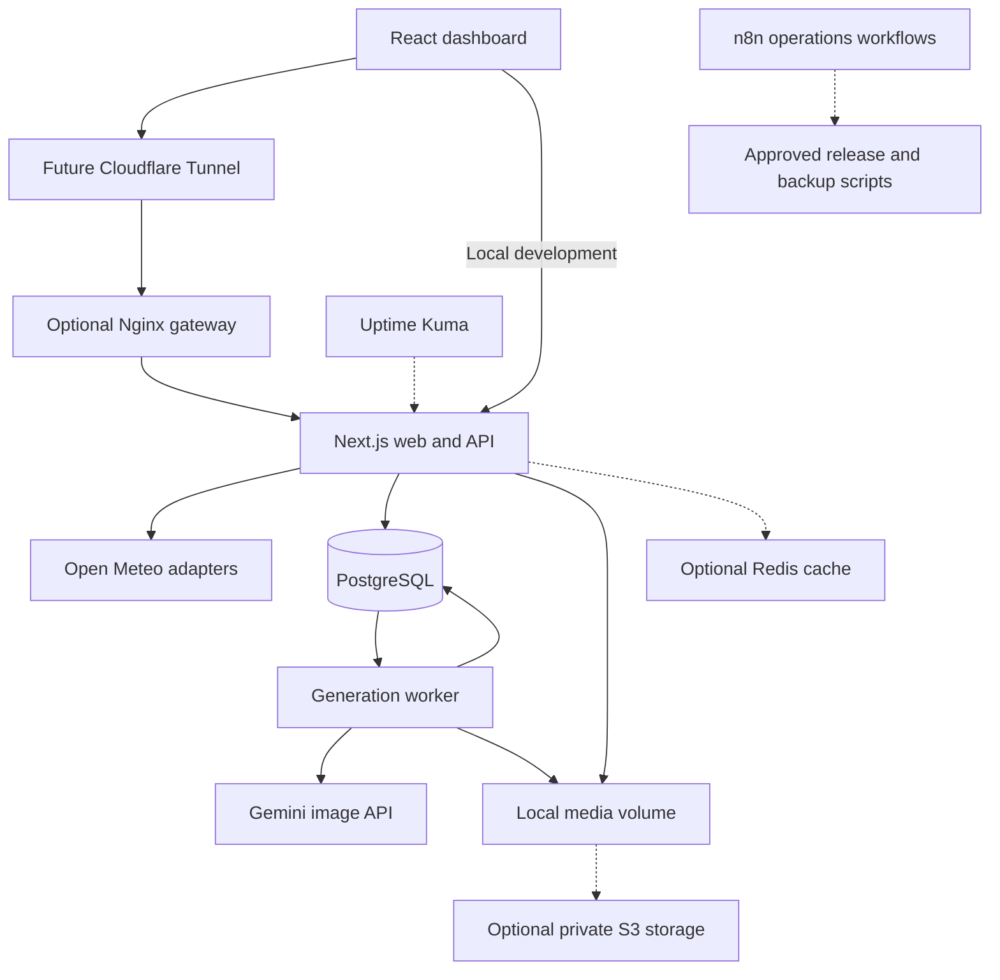

# Architecture

Status: weather dashboard deployed to a separate Pi origin on 10 October 2026. The dashboard, location and weather routes, consent controlled cookie preferences, adaptive atmospheric background, deterministic image prompt builder, and server only Gemini adapter exist. The connector, HTTPS hostname, outage and recovery workflow, and controlled Resend acceptance are recorded in [operations](OPERATIONS.md). Image admission, durable jobs, database, and media remain proposed. No hardware performance benchmark is claimed.

Current runtime requires Node.js 24 and npm only. Weather runs without an environment file. The Gemini adapter is not connected to a browser generation route; adding a key does not enable generation. One authorized live image probe returned HTTP 429 for image quota.

Implemented caches are bounded in memory: searches retain results for ten minutes, canonical locations are fresh for 24 hours with a seven day fallback, and weather is fresh for five minutes with a 30 minute labelled fallback. Weather fallback cannot cross the location's date boundary. Identical upstream reads are coalesced. Retry backoff, jitter, shared caching, and request IDs below are future targets.

The product runs locally from a fresh clone and fits alongside existing projects on a Raspberry Pi 4 with 4 GB RAM. The owner authorized a dedicated Cloudflare tunnel and a loopback only origin. Existing repositories, services, networks, and tunnel routes are outside this project's change boundary.

## 1. Technology decisions

| Component | Proposed choice | Purpose |
| :--- | :--- | :--- |
| Application | Next.js 16.4.0, React 19.3.0, TypeScript | One repository for the dashboard and server routes |
| Runtime | Node.js 24 LTS | Local development, worker, and production runtime |
| Weather | Open Meteo geocoding and forecast APIs | Structured location matches and numerical weather data |
| Images | Gemini through a server adapter | One image from a deterministic weather prompt; browser integration pending |
| Persistence | PostgreSQL in local and public modes | Jobs, ownership, quota reservations, and image metadata |
| Media | Local persistent volume initially | Store generated image bytes outside the database |
| Production packaging | Docker Compose with independent web and worker services | Isolate resources and restart services separately |
| Optional later components | Nginx, Redis, S3 compatible storage | Add capabilities only when their launch criteria apply |

The framework versions are pinned with the npm lockfile. Local checks use Node.js 24.21.0. Node 24 is an LTS release in the [Node release schedule](https://nodejs.org/en/about/previous-releases).

The configured image model is `gemini-3.1-flash-image`. Server settings request one 16:9 image at 1K. The stable alias is not an immutable model snapshot. A valid credential and model listing were verified; a single live image request returned a quota failure. Live output quality, successful latency, and cost remain unverified. See the [provider record](PROVIDER.md) and [official image guide](https://ai.google.dev/gemini-api/docs/image-generation). Record any model change explicitly.

Open Meteo's free hosted service has noncommercial usage restrictions, rate limits, and attribution requirements. Public availability alone does not establish eligibility. Review the intended portfolio use before launch and retain a paid endpoint configuration path if necessary. [Provider terms](https://open-meteo.com/en/terms).

## 2. Process and network boundaries

The future image phase will use Compose for PostgreSQL and one development launcher for web and worker processes. Production will use the same database implementation with separate containers. Today's weather release uses `npm run dev` alone; generation is visibly disabled without breaking the cards.

Future image prerequisites include Docker Engine or Docker Desktop with Compose V2. Pin a supported PostgreSQL major and tested image digest in phase 3. For host run development, bind its database port only to loopback; production uses private container networking with no published database port. The future launcher must wait for readiness, apply migrations, start web and worker processes, and forward shutdown signals safely. Verify that sequence from a clean clone before documenting it as working.



The diagram is a proposed public topology. Cloudflare Tunnel creates outbound connections, so the future deployment does not require a public Pi address or router port forwarding. The tunnel is connectivity infrastructure; application authorization and spending controls remain necessary. [Tunnel documentation](https://developers.cloudflare.com/cloudflare-one/networks/connectors/cloudflare-tunnel/).

For public hosting, use the existing trusted gateway if it provides request limits and correct forwarding behavior. Otherwise add this project's Nginx gateway. Next.js recommends a reverse proxy for self hosting. Keep application and database listeners on private networks, and only trust forwarding headers from that gateway. [Next.js self hosting](https://nextjs.org/docs/app/guides/self-hosting).

## 3. Module boundaries and contracts

The proposed source tree is small enough to navigate without separate packages for every feature.

```text
src/
  app/
    api/locations/
    api/weather/
    api/generations/
    api/media/
    api/health/
  features/
    locations/
    weather/
    artwork/
  domain/
    locations/
    weather/
    prompts/
    generations/
  server/
    config/
    providers/
    cache/
    repositories/
    storage/
    security/
    observability/
  worker/
db/migrations/
tests/fixtures/
tests/integration/
tests/browser/
ops/
```

Route handlers validate input, call an application service, and serialize a result. Domain modules do not depend on React or a provider SDK. Database and provider adapters are server only. Components receive explicit loading, success, stale, empty, and error states.

| Contract | Required behavior |
| :--- | :--- |
| `LocationProvider.search(query, signal)` | Return canonical matches with provider ID, place, region, country, coordinates, and IANA timezone |
| `LocationProvider.resolve(id, signal)` | Resolve an accepted provider ID without trusting browser coordinates or labels |
| `WeatherProvider.get(location, signal)` | Return validated numerical data, explicit units, provider timestamp, fetch timestamp, and timezone |
| `PromptBuilder.build(snapshots, version)` | Pure function producing the exact prompt from four ordered snapshots |
| `GenerationService.create(session, request)` | Check ownership, freshness, quotas, and idempotency before persisting a job |
| `GenerationRepository.claim(workerId)` | Claim one eligible job with a lease and expected version |
| `ImageProvider.generate(prompt, settings, signal)` | Produce bounded image bytes or a classified provider error |
| `MediaStore.put(key, bytes, metadata)` | Persist media atomically and return a durable object reference |
| `MediaStore.read(reference)` | Read an authorized object's bytes or mint temporary access after authorization |

Implemented HTTP routes are `GET /api/locations?q=`, `GET /api/weather?locationId=`, and `GET /api/health`. Proposed image routes are `POST /api/generations`, `GET /api/generations/:id`, and `GET /api/media/:id`. Future generation accepts exactly four distinct location IDs and an idempotency key. It must accept no client weather values, arbitrary prompt, model, quality, or upstream URL.

Successful creation returns `202` with a job ID and status URL. A repeated matching idempotency key returns the existing job; reuse with a different payload returns `409`. Errors use a stable code, readable message, request ID, and retryability indicator without exposing stacks or secrets.

## 4. Locations, weather, and time

Search results must show place, region, and country before selection. Store up to four ordered canonical location references in versioned browser storage. Validate restored data and handle unavailable browser storage without losing the current in memory selection. Duplicate IDs are rejected; removal leaves an available slot.

Geocoding supplies administrative fields, coordinates, timezone, and identifiers. The server resolves selected IDs before fetching weather. [Geocoding API](https://open-meteo.com/en/docs/geocoding-api).

Request current temperature, weather code, wind speed, and day or night information, plus daily temperature maximum and minimum. Explicitly request Celsius and km/h. Use provider weather codes to select conditions text; unknown codes and missing values display as unavailable. Numerical values never come from an image or language model. [Forecast API](https://open-meteo.com/en/docs).

Use absolute timestamps internally and the returned IANA timezone for the clock. Resolve today's daily record against the location's date, not the browser or server date. The adapter must handle the provider's daily timestamp convention explicitly. Request Unix timestamps where appropriate and test daylight saving transitions, unusual offsets, opposite dates across the date line, and a cached response crossing local midnight. The forecast documentation describes timezone and timestamp behavior. [Time parameters](https://open-meteo.com/en/docs#api-documentation).

Each card fetches independently with cancellation and a bounded deadline. Replacing a location must prevent an older response from overwriting its replacement. A failed card retains its location and offers retry; other cards stay usable. Clock ticks are computed locally rather than causing weather API calls.

Generation obtains and validates four snapshots on the server. If any location lacks sufficiently fresh weather, it names the affected location and does not submit a paid image request. Store observed time separately from fetch time. Cached weather may satisfy freshness policy, but fetching stale provider data again does not make it current.

## 5. Durable jobs and spending

| State | Meaning | Recovery rule |
| :--- | :--- | :--- |
| `queued` | Validated job and quota reservation are persisted | Worker may claim it |
| `running` | A worker owns a renewable lease | Persist provider attempt stage and request ID when available |
| `succeeded` | Image bytes and metadata are persisted | Return the stored image and exact saved prompt |
| `refused` | Provider explicitly rejected generation | Explain refusal; require a new user request |
| `failed` | A classified failure has a known outcome | Retry only when no ambiguous paid submission occurred |
| `unknown` | Submission may have reached the provider, but outcome is uncertain | Retain reservation and do not automatically resubmit |
| `expired` | Retention policy removed the media | Explain expiry while retaining required accounting records |

1. Validate and hash the normalized request intent, including the ordered location identifiers. Look up the session and idempotency key before fetching weather. Return an existing matching job even if live weather has changed or its provider is unavailable. A different intent returns a conflict. Do not fingerprint freshly fetched weather, the prompt, or changed server defaults.
2. For a new intent, resolve four locations and capture validated weather. In one short transaction, recheck the idempotency key, lock quota rows, check session and global caps, reserve capacity, and insert the job with its intent hash and immutable snapshots.
3. Claim jobs using a short transaction with row locking and `SKIP LOCKED`, then release the connection before network work. PostgreSQL documents this as suitable for queue consumers. [SELECT locking](https://www.postgresql.org/docs/current/sql-select.html).
4. Persist the attempt boundary with a conditional update that verifies the current lease token, expected version, and unexpired lease. Require that transition to succeed before calling the provider. A worker that resumes after losing its lease cannot dispatch. Disable automatic paid request retries unless the provider's confirmed idempotency semantics make them safe.
5. Validate returned bytes, persist media, then atomically finalize job metadata and accounting. If finalization fails, recover a saved artifact rather than generate again.
6. Recover expired leases according to the persisted attempt stage. A crashed or timed out submission becomes `unknown` when its external outcome cannot be established.

This is not a promise of exactly once provider billing. A crash between external submission and local acknowledgement can leave an uncertain result. Lease tokens and conditional updates prevent an old worker from finalizing a job reclaimed by another worker.

The initial worker concurrency is one and the queue has a configurable finite capacity. Per session and IP limits supplement a durable global request cap. Reserve a conservative cost estimate for fixed server settings; reconcile reported usage where available. The application cap is enforced transactionally and does not rely on a provider dashboard alert being a hard limit.

Generation is disabled when required keys or cap configuration are absent. Database, admission, or verification failures reject new paid requests. A refusal or timeout never clears an accounting reservation merely because the UI stopped waiting. Refund only an outcome confirmed not to incur a charge.

Persist prompt version, exact prompt, location order, snapshots, model snapshot, image settings, attempt stage, provider request ID, timestamps, and media reference. The artwork always shows that record's prompt even when locations or live weather change later.

## 6. Database and media limits

Use one PostgreSQL backend across development, tests, and deployment. Proposed tables are anonymous sessions, generation jobs, provider attempts, quota windows, usage ledger, and media objects. Location preferences remain in the browser. Add unique session and idempotency constraints, foreign keys, state checks, and indexes for claim and ownership queries.

Start with a web connection pool of four and worker pool of two, plus a separately bounded migration connection. Configure a database connection ceiling with space for administration, and count the total across replicas. Set query, lock, and idle transaction deadlines. Do not keep a database transaction open while waiting for weather or images.

Local media lives in a project specific persistent volume with opaque generated keys. Write through a temporary file and atomic rename. Never construct a path from an untrusted filename. Validate type and maximum decoded size; record byte count, dimensions, and checksum. Mark success only after storage is durable.

Provisional retention is seven days for generated media, subject to owner review. Set a media byte quota, cleanup schedule, and disk free threshold before public launch. Clean orphaned files after a grace period and retain accounting records long enough to audit caps and unresolved submissions.

An S3 compatible adapter becomes useful when off host durability or local disk pressure warrants it. Keep its bucket private, credentials restricted to the project prefix, and object IDs stable. Authorize requests before issuing short lived presigned URLs and refresh expired links without generating a new image. S3 presigned links are bearer tokens with credential dependent expiry. [S3 access documentation](https://docs.aws.amazon.com/AmazonS3/latest/userguide/using-presigned-url.html).

## 7. Cache policy and optional infrastructure

| Data | Initial proposed policy | Failure behavior |
| :--- | :--- | :--- |
| Search matches | Bounded process cache; 24 hour positive TTL, 60 second empty TTL | Return a clear search error if no valid cache entry exists |
| Canonical locations | Bounded process cache; 24 hour TTL | Revalidate saved IDs when needed |
| Current weather | Five minute fresh TTL; labelled stale fallback capped at 30 minutes | Keep the card readable; enforce stricter generation freshness |
| Generated images | Persistent object reference | Reuse the saved result rather than invoke the provider |
| Session jobs and admission | PostgreSQL; no public HTTP caching | Fail closed for paid requests |

Cache keys include provider version, exact resolved coordinates, timezone, units, and requested fields. Do not round distinct coordinates into accidental matches. Expire daily data at local day changes. Bound entries and bytes, add TTL jitter, and coalesce identical in process requests. Retry safe weather reads with bounded backoff and honor provider rate limits.

Redis is optional. Consider it when more than one web replica runs, or a measured load test shows duplicate refreshes dominating upstream traffic despite coalescing. Use it for shared disposable caches and rate limit acceleration, while PostgreSQL remains the durable quota authority. Do not mix an evicting cache with financial reservations or indispensable queue state. If locks are introduced, compare ownership before release. [Redis locking guidance](https://redis.io/docs/latest/develop/clients/patterns/distributed-locks/).

Nginx microcaching is optional after measured API load justifies it. Cache only explicitly public GET responses with a reviewed key. Never blanket cache Next.js HTML, responses containing cookies, generation POSTs, owned jobs, or presigned media access. Respect `Cache-Control` and `Vary`, with deliberate stale and locking rules. [Nginx proxy cache](https://nginx.org/en/docs/http/ngx_http_proxy_module.html).

XFetch is deferred until hot key expiry still creates a measured refresh problem. Singleflight, jitter, and bounded stale fallback are sufficient initial mechanisms. Cloudflare's proxied DNS records use automatic TTL; this application does not need its own Anycast or DNS tuning system. [Cloudflare TTL](https://developers.cloudflare.com/dns/manage-dns-records/reference/ttl/).

## 8. Security and failure boundaries

| Boundary | Required control before public launch |
| :--- | :--- |
| Anonymous ownership | Opaque random session token in an HttpOnly cookie; hashed token at rest; Secure in production; restricted SameSite policy; expiry |
| Job and media access | Check ownership on every request; IDs alone never grant access; neutral response for another session's object |
| State changing requests | Validate allowed Origin and JSON content type; reject unexpected fields; use bounded request bodies |
| Paid public requests | Server validated Turnstile or invited access policy, session and IP limits, global caps, and one active job per session |
| Provider requests | Fixed trusted origins and bounded deadlines; no user supplied URL, redirect target, model, or pricing parameters |
| Server secrets | Validated server configuration; no provider key in browser bundles, logs, prompts, workflow output, or image metadata |
| Untrusted content | Render location names and prompts as text; limit length and control characters; no raw HTML injection |
| Storage exhaustion | Bound media bytes, cache entries, queued jobs, decoded image size, and retained logs |
| Container isolation | Nonroot process, private network, minimal writable volumes, no privileged mode or Docker socket in the app |

Turnstile requires server verification; the widget alone is insufficient. It raises the cost of abuse but does not replace spending caps. [Turnstile verification](https://developers.cloudflare.com/turnstile/get-started/server-side-validation/).

Return job acceptance immediately and poll its status with bounded intervals and backoff. Reloading or closing a browser does not cancel an already submitted provider request. Cloudflare recommends polling for long operations that could exceed its proxy deadline. [Proxy timeout guidance](https://developers.cloudflare.com/support/troubleshooting/http-status-codes/cloudflare-5xx-errors/error-524/).

## 9. Pi capacity, releases, and operations

The Pi's operating system architecture, free memory, storage medium, current load, and service networks remain uninspected. The following limits are provisional starting points for this project, not guarantees that it fits the shared machine. Validate sustained load and headroom before deployment.

| Service | Provisional memory ceiling | Provisional CPU ceiling |
| :--- | :--- | :--- |
| Web | 384 MiB | 0.5 CPU |
| Worker | 384 MiB | 0.5 CPU; one generation |
| PostgreSQL | 256 MiB | 0.5 CPU; deliberately small pools |
| Optional project gateway | 64 MiB | 0.25 CPU |

These ceilings exclude existing services, the operating system, filesystem cache, the tunnel, and build workloads. Configure the Node heap below its container memory ceiling and validate image decoding peaks. Prefer persistent SSD storage if available. Build images on GitHub hosted runners rather than consuming Pi build resources. Confirm a 64 bit OS before selecting an ARM64 artifact.

Ordinary public pull requests run without paid keys or deployment credentials. GitHub offers hosted ARM64 Linux runners, while its security guidance discourages public repository self hosted runners. Never execute public pull request code on the shared Pi. Pin workflow actions to verified commit SHAs and publish immutable release image digests after tests. [Hosted runners](https://docs.github.com/en/actions/reference/runners/github-hosted-runners), [Actions security](https://docs.github.com/en/actions/reference/security/secure-use).

n8n is an optional operations coordinator for approved release pulls, backup schedules, cleanup, and alerts. It is outside weather and image request handling. Export credential free workflow templates only. Use authenticated production webhooks, allowlisted release identities, and fixed scripts; never execute shell text supplied by a webhook. n8n distinguishes test and production webhook endpoints and supports authentication. [Webhook documentation](https://docs.n8n.io/integrations/builtin/core-nodes/n8n-nodes-base.webhook).

Provide cheap liveness, database readiness, and worker heartbeat checks. Do not make every health probe call a paid provider or restart a healthy app during an upstream outage. Track request failures, upstream latency, cache hits, queue age, unknown jobs, quota rejections, media bytes, and disk space with redacted structured logs.

Uptime Kuma can monitor HTTP readiness and the worker heartbeat without Docker socket access. A monitor on the same Pi cannot detect its own complete power or network loss; add an external check for that boundary. Keep operations interfaces behind restricted access. [Kuma socket security](https://github.com/louislam/uptime-kuma/wiki/How-to-Monitor-Docker-Containers).

Back up PostgreSQL and media to a separate destination, record backup age, and prove a restore. Release scripts must use a project specific Compose name and volumes, check readiness, and support rollback to the previous digest. Database changes use compatible migrations with a recovery plan; reverting an image alone does not revert a schema.

## 10. Delivery evidence

The [delivery plan](DELIVERY_PLAN.md) defines shipment stages and the [verification strategy](VERIFICATION.md) defines required checks. Initial launch evidence must include all four locations, local time correctness, independent weather failures, the exact displayed prompt, ownership isolation, duplicate submission handling, refusal and timeout behavior, restart recovery, quota races, backup restoration, and release rollback.

Accessibility, reduced motion, responsive layout, and Lighthouse targets are verified against documented pages and conditions. They are acceptance targets, not current scores. Application readiness, production security, image account access, and Pi capacity must be reported from actual evidence before the corresponding stage is called complete.
